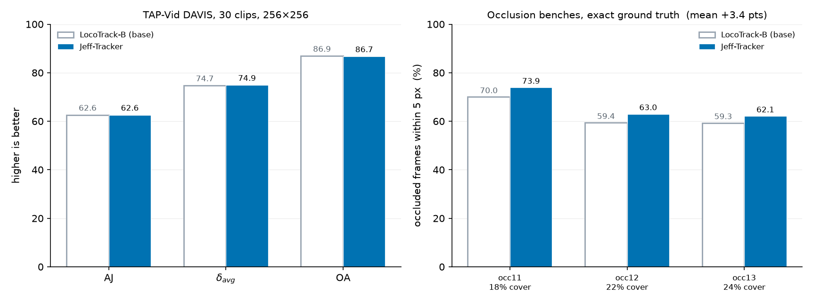
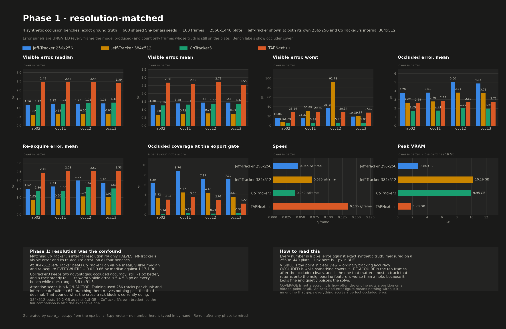

<div align="center">


**Track any point through a video.**

[](LICENSE)
[](https://huggingface.co/JeffyAntony/Jeff-Tracker)
[](https://github.com/cvlab-kaist/locotrack)
[](docs/BENCHMARK.md)


</div>

---

Give it a video and a set of points; it returns where each point is on every frame, whether
it can see it, and how sure it is. It runs at **0.0065 s/frame** and returns a **calibrated
per-frame confidence** alongside every track.

It is [LocoTrack-B](https://github.com/cvlab-kaist/locotrack) with cross-track attention
added — the tracks attend to each other, so a point that is hidden can be inferred from the
neighbours that are still visible — then fine-tuned on MOVi-E for occlusion.

## Results



| | Jeff-Tracker |
|---|---|
| TAP-Vid DAVIS, 30 clips (AJ / δ_avg / OA) | **62.6 / 74.9 / 86.7** |
| Localisation, exact synthetic ground truth | **1.03 px** @ 256×256 · **0.54 px** @ 384×680 |
| Pixel locking | **+0.0005 px** — none, on an NCC-free path |
| Confidence as a bad-frame detector | **AUC 0.955** @ 256×256 |
| Occluded frames within 5 px, vs the base | **+3.4 points**, held out over three benches |
| Speed | **0.0065 s/frame** · 6.85 GB peak on 4K |

The right-hand panel is what the fine-tune bought: occluded accuracy on three synthetic
benches with exact ground truth, built *after* the shipping checkpoint was selected. The
left panel is the control that stops it being read alone — on DAVIS the model is level with
its base, so the occlusion gain did not cost general accuracy.

Protocol, controls and per-checkpoint numbers: **[docs/BENCHMARK.md](docs/BENCHMARK.md)**
and **[docs/METHOD.md](docs/METHOD.md)**.

## Comparison

Against **CoTracker3** and **TAPNext++** on four synthetic occlusion benches with exact
ground truth, same footage and the same 600 seeds for every engine:

| at matched resolution (384x512) | Jeff-Tracker | CoTracker3 |
|---|---|---|
| visible error, median | **0.62 - 0.66 px** | 1.17 - 1.30 px |
| re-acquire after an occluder | **0.85 - 1.06 px** | 1.36 - 1.62 px |
| occluded error, mean | 2.62 - 3.82 px | **1.69 - 1.99 px** |
| visible error, worst | 6.8 - 91.8 px | **5.4 - 5.8 px** |

Jeff-Tracker localises about **2x tighter** and returns from occlusions closer. CoTracker3
is still **~1.5x better while a point is hidden**, and has a far steadier worst case.

Resolution is doing a lot of that work: at the 256x256 default the localisation advantage
disappears, and 384x512 costs 10.2 GB against 2.8 GB. Full tables, method, and what is and
is not held equal: **[docs/COMPARISON.md](docs/COMPARISON.md)**.

CoTracker3 is CC-BY-NC-4.0. It is not vendored, redistributed, or used to train or select
anything here - `tools/bench3.py` loads it from a path you supply, and only to measure.
See [docs/LICENSES.md](docs/LICENSES.md).



## Two things it does not do

<table>
<tr>
<td width="50%"></td>
<td width="50%"></td>
</tr>
<tr>
<td><b>It tells you when it is unsure.</b> Points coloured by the model's own confidence,
green through red. That signal detects its own &gt;5 px frames at AUC 0.955 and costs
nothing — it is already computed. Keep it.</td>
<td><b>It gaps an occlusion instead of crossing one.</b> Hollow rings are points held at
their last committed position — only ~6% of ground-truth-occluded frames get a position at
all, and after 8 frames the track retires. The limitation, drawn rather than described.</td>
</tr>
</table>

Two more, stated plainly:

- **Use `--model-res 256x256`.** Higher lowers the median and raises the tail. At 384×680
  the median visible error improves to 0.697 px while the *mean* is 40.6 px, and no
  confidence threshold recovers it — at conf ≥ 0.99 the mean is still 39.3 px.
- **It is a seed-and-track stage, not a finished pipeline.** Its 1.03 px synthetic figure
  is raw neural output with no refinement; a classical sub-pixel pass downstream still buys
  most of an order of magnitude.

## Install

```bash
git clone https://github.com/antonyjaguar19-dotcom/Jeff-Tracker
cd Jeff-Tracker
pip install torch --index-url https://download.pytorch.org/whl/cu121   # match your CUDA
pip install -r requirements.txt
```

The trained checkpoint is gated. Request access on
[the model page](https://huggingface.co/JeffyAntony/Jeff-Tracker); once granted:

```bash
hf auth login
python tools/fetch_weights.py --all
```

`python tools/fetch_weights.py --baseline-only` fetches the LocoTrack baseline without an
account, which is enough to reproduce the `--arch locotrack` rows. LocoTrack is vendored
under `vendor/locotrack/`, so there is nothing else to clone.

## Use

```python
import torch
tracker = torch.hub.load("antonyjaguar19-dotcom/Jeff-Tracker", "jefftracker").cuda()

# frames: (T, H, W, 3) uint8 BGR      queries: (N, 3) as [frame, x, y]
tracks, vis, conf = tracker.track_queries_conf(frames, queries)
# tracks (T, N, 2) xy in the input frames' pixel space, y DOWN
# vis    (T, N) bool   -- conf >= 0.5
# conf   (T, N) float  -- 1 - P(occluded or uncertain), continuous
```

A directory of frames straight to 3DE-style 2D-track ASCII plus an overlay mp4:

```bash
python tools/run_jefftrack.py --plate /path/to/frames --name myshot --seed corners --points 600
```

## Verify

Every number in [docs/METHOD.md](docs/METHOD.md) has a control pass behind it that returns a
value which *should* be zero. Both metric defects found while building this were metrics
measuring the input instead of the tracker, and each was caught this way.

```bash
python -m jefftrack.engine --selftest       # rigid translation, exact GT -> 0.100 px
python tools/check_identity.py              # untrained cross-attention IS the base -> 0.000e+00
python tools/score_occlusion.py --control   # scorer against truth -> 0.00000 px
python tools/eval_tapvid.py --mode strided  # the port -> 67.7 / 79.5 / 89.8
```

`check_identity.py` is the load-bearing one: with cross-track attention zero-initialised the
model is its base bit for bit, so anything measured after training is attributable to the
new blocks rather than to the port.

## Train

```bash
python tools/probe_data.py --batches 2      # data control pass -- run this first
python tools/train_cross.py --occ-pos-weight 0.2 --steps 4000
python tools/score_ckpt.py --ckpt weights/step4000.ckpt --tag s4000
```

`--occ-pos-weight` is the flag the whole result turns on. The base objective zeroes the
position loss on occluded frames, so it cannot teach a model to cross an occlusion whatever
attention you add; `0.2` weights an occluded point at one fifth of a visible one.
~2 s/step at 2.3 GB on an RTX A4000.

## Layout

```
jefftrack/ engine.py  io.py  losses.py  model/  data/
tools/     run, train, benchmark, demos, control passes
docs/      METHOD.md (measurements)  BENCHMARK.md (protocol)
           COMPARISON.md (vs CoTracker3 & TAPNext++)  LICENSES.md (provenance)
assets/    README media
vendor/    LocoTrack, vendored
```

## License

Apache-2.0. See [LICENSE](LICENSE) and [NOTICE](NOTICE); provenance for every
third-party artifact is in [docs/LICENSES.md](docs/LICENSES.md). Demo footage is from
DAVIS — see [assets/README.md](assets/README.md).

## Citing

```bibtex
@inproceedings{cho2024locotrack,
  title     = {Local All-Pair Correspondence for Point Tracking},
  author    = {Cho, Seokju and Huang, Jiahui and Nam, Seungryong and
               Min, Dongbo and Lee, Joon-Young},
  booktitle = {ECCV},
  year      = {2024}
}
```
