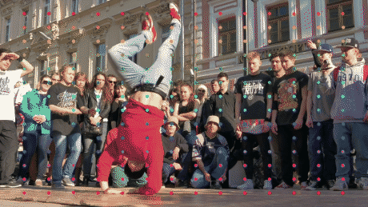
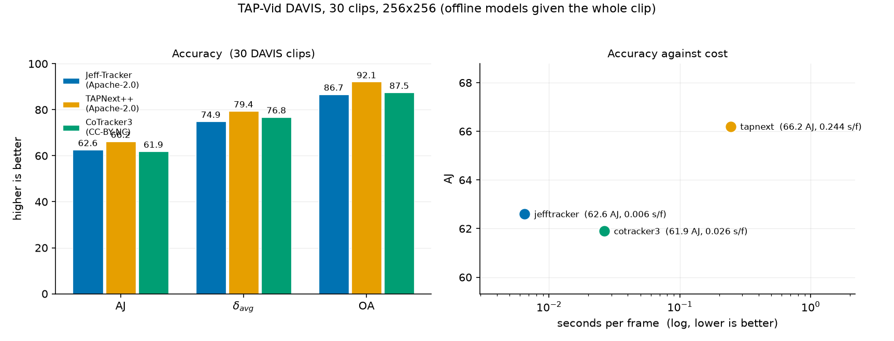
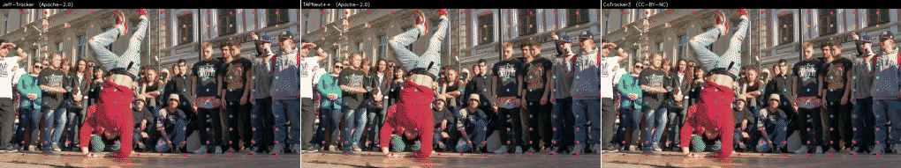
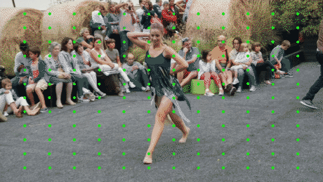
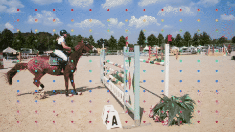

<div align="center">


**An Apache-2.0 point tracker in the CoTracker class.**

[](LICENSE)
[](https://huggingface.co/antonyjaguar19-dotcom/Jeff-Tracker)
[](https://github.com/cvlab-kaist/locotrack)
[](docs/METHOD.md)



</div>

---

The strongest open point trackers — CoTracker3, MFT, SpatialTracker — are **CC-BY-NC** on
code *and* weights. NonCommercial restricts **use**, not just redistribution, so "we only
run it in-house" does not make them safe in a commercial pipeline.

Jeff-Tracker is [LocoTrack-B](https://github.com/cvlab-kaist/locotrack) (Apache-2.0) plus
cross-track attention, written from the CoTracker3 paper
([arXiv:2410.11831](https://arxiv.org/abs/2410.11831)) and fine-tuned on Apache-2.0 MOVi-E.
Code, base weights and training data are Apache-2.0 end to end. No CoTracker code, weights
or tensors are in this repository — architecture is not copyrightable, source code is.

## Benchmark

TAP-Vid DAVIS, 30 clips, 256×256, the reference metric called unmodified.





*Same clip, same seeds, same overlay code — so what differs is the trackers.*

| model | licence | AJ | δ_avg | OA | s/frame |
|---|---|---|---|---|---|
| **TAPNext++** | Apache-2.0 | **66.2** | **79.4** | **92.1** | 0.2440 |
| Jeff-Tracker | Apache-2.0 | 62.6 | 74.9 | 86.7 | **0.0065** |
| CoTracker3 | CC-BY-NC | 61.9 | 76.8 | 87.5 | 0.0264 |

**TAPNext++ is the most accurate model here, and it is also Apache-2.0.** That is not the
result this project set out to find, and it goes first because burying it would make
everything else here less trustworthy. If accuracy is all that matters and the licence must
be clean, use TAPNext++.

Jeff-Tracker's case is cost: **37× faster** at 3.6 AJ behind, plus a calibrated per-frame
confidence neither of the others returns. Against CoTracker3 — the model whose licence
motivated the project — it is +0.7 AJ and −1.9 δ_avg at a quarter of the cost.

Two caveats that belong next to the table, not in a footnote: the ranking is unchanged
under a second protocol (no model moves more than 0.5 AJ), and **CoTracker3 measures below
its published figure here** — resolution was ruled out as the cause (+0.6 AJ), the metric
definition is the likely reason, and the row should be read as "as configured here" rather
than as a refutation of its paper.

Reproduce, and read [docs/BENCHMARK.md](docs/BENCHMARK.md) before quoting any of it:

```bash
python tools/benchmark.py --models jefftracker,tapnext,cotracker3 --whole-clip \n    --out out/benchmark_whole.json
python tools/plot_benchmark.py --json out/benchmark_whole.json --out assets/benchmark.png
```

Only Jeff-Tracker is built in. TAPNext++ and CoTracker3 are loaded from paths you supply;
neither is vendored here, and **CoTracker3 is CC-BY-NC — running it is your licence call,
not this repository's.**

## Two things it does not do

<table>
<tr>
<td width="50%"></td>
<td width="50%"></td>
</tr>
<tr>
<td><b>It tells you when it is unsure.</b> Points coloured by the model's own confidence,
green through red. That signal detects its own &gt;5 px frames at AUC 0.955 and costs
nothing — it is already computed. Keep it.</td>
<td><b>It gaps an occlusion instead of crossing one.</b> Hollow rings are points held at
their last committed position — only ~6% of ground-truth-occluded frames get a position at
all, and after 8 frames the track retires. The limitation, drawn rather than described.</td>
</tr>
</table>

Two more, stated plainly:

- **Use `--model-res 256x256`.** Higher lowers the median and raises the tail. At 384×680
  the median visible error improves to 0.697 px while the *mean* is 40.6 px, and no
  confidence threshold recovers it — at conf ≥ 0.99 the mean is still 39.3 px.
- **It is a seed-and-track stage, not a finished pipeline.** Its 1.03 px synthetic figure
  is raw neural output with no refinement; a classical sub-pixel pass downstream still buys
  most of an order of magnitude.

## Install

```bash
git clone https://github.com/antonyjaguar19-dotcom/Jeff-Tracker
cd Jeff-Tracker
pip install torch --index-url https://download.pytorch.org/whl/cu121   # match your CUDA
pip install -r requirements.txt
python tools/fetch_weights.py --all
```

LocoTrack is vendored under `vendor/locotrack/`, so there is nothing else to clone. Weights
are on the Hugging Face Hub, not in git.

## Use

```python
import torch
tracker = torch.hub.load("antonyjaguar19-dotcom/Jeff-Tracker", "jefftracker").cuda()

# frames: (T, H, W, 3) uint8 BGR      queries: (N, 3) as [frame, x, y]
tracks, vis, conf = tracker.track_queries_conf(frames, queries)
# tracks (T, N, 2) xy in the input frames' pixel space, y DOWN
# vis    (T, N) bool   -- conf >= 0.5
# conf   (T, N) float  -- 1 - P(occluded or uncertain), continuous
```

A directory of frames straight to 3DE-style 2D-track ASCII plus an overlay mp4:

```bash
python tools/run_jefftrack.py --plate /path/to/frames --name myshot --seed corners --points 600
```

## Verify

Every number in [docs/METHOD.md](docs/METHOD.md) has a control pass behind it that returns
a value which *should* be zero. Both metric defects found while building this were metrics
measuring the input instead of the tracker, and each was caught this way.

```bash
python -m jefftrack.engine --selftest         # rigid translation, exact GT -> 0.100 px
python tools/check_identity.py              # untrained Jeff-Tracker IS LocoTrack -> 0.000e+00
python tools/score_occlusion.py --control   # scorer against truth -> 0.00000 px
python tools/eval_tapvid.py --mode strided  # the port -> 67.7 / 79.5 / 89.8
```

`check_identity.py` is the load-bearing one: with cross-track attention zero-initialised the
model is LocoTrack bit for bit, so anything measured after training is attributable to the
new blocks rather than to the port.

## Train

```bash
python tools/probe_data.py --batches 2      # data control pass -- run this first
python tools/train_cross.py --occ-pos-weight 0.2 --steps 4000
python tools/score_ckpt.py --ckpt weights/step4000.ckpt --tag s4000
```

`--occ-pos-weight` is the flag the whole result turns on: `0.0` is the vendor objective,
which zeroes the position loss on occluded frames and therefore cannot teach a model to
cross an occlusion whatever attention you add. `0.2` is CoTracker3's `(𝟙_occ/5 + 𝟙_vis)`
weighting, implemented from the paper's formula. ~2 s/step at 2.3 GB on an RTX A4000.

## Layout

```
jefftrack/ engine.py  io.py  losses.py  model/  data/
tools/     run, train, benchmark, demos, control passes
docs/      METHOD.md (measurements)  BENCHMARK.md (protocol)  LICENSES.md (provenance)
assets/    README media + source attribution
vendor/    LocoTrack, redistributed Apache-2.0
```

## Licence

Apache-2.0 — [LICENSE](LICENSE), [NOTICE](NOTICE), and
[docs/LICENSES.md](docs/LICENSES.md) for the artifact-by-artifact ledger.
Demo footage is DAVIS (CC BY 4.0); attribution in [assets/README.md](assets/README.md).

## Citing

```bibtex
@inproceedings{cho2024locotrack,
  title     = {Local All-Pair Correspondence for Point Tracking},
  author    = {Cho, Seokju and Huang, Jiahui and Nam, Seungryong and
               Min, Dongbo and Lee, Joon-Young},
  booktitle = {ECCV},
  year      = {2024}
}
@inproceedings{karaev2024cotracker3,
  title     = {CoTracker3: Simpler and Better Point Tracking by Pseudo-Labelling
               Real Videos},
  author    = {Karaev, Nikita and Makarov, Iurii and Wang, Jianyuan and
               Rocco, Ignacio and Graham, Benjamin and Neverova, Natalia and
               Vedaldi, Andrea and Rupprecht, Christian},
  booktitle = {arXiv:2410.11831},
  year      = {2024}
}
```
