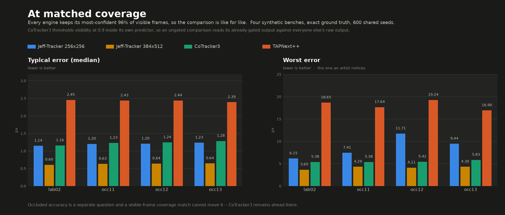
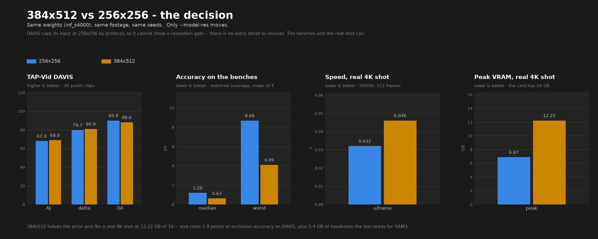

# Jeff-Tracker against CoTracker3 and TAPNext++, on exact ground truth

Read [`LICENSES.md`](LICENSES.md) first — CoTracker3 is CC-BY-NC-4.0, it is not vendored or
redistributed here, and what appears below is measurement, not code or weights.

Everything in this document is reproducible from `tools/bench3.py`, `tools/score_sheet.py`
and `tools/render_bench3.py` against benches `tools/make_occlusion_bench.py` builds.

## What is held equal

| | |
|---|---|
| footage | decoded **once** and the same array handed to every engine |
| seeds | the same 600 Shi-Tomasi corners from frame 1, the same array for every engine |
| scoring | one scorer, one ground truth, one occlusion mask, output scaled back to plate pixels the same way |
| benches | four synthetic occlusion shots, exact homography truth for every point on every frame, occluder cover 10.5% / 17.8% / 21.5% / 24.4% |

What is **not** held equal, and why it matters more than it sounds: each engine runs at its
own native resolution, because that is the configuration each ships as. CoTracker3 resizes
internally to 384×512 whatever it is fed. Jeff-Tracker's default is 256×256. That is roughly
three times the pixels, and correcting it changes the result — see
[At matched resolution](#at-matched-resolution).

## Two scoring rules that decide the answer

Both were found while producing this document, and both moved numbers by more than the
differences being measured.

**Truth that has left the plate is not scored.** A point whose ground-truth position is
outside the picture cannot be tracked, and the error against it measures nothing about the
tracker. These are ~1.2% of visible samples and they carried the entire tail:

| lab02_occ, visible | worst, off-plate included | worst, on-plate only |
|---|---|---|
| Jeff-Tracker | 389.30 px | **16.86 px** |
| TAPNext++ | 79.96 px | **28.14 px** |
| CoTracker3 | 6.87 px | **5.69 px** |

**Re-acquisition is scored ungated.** `write_3de` drops frames the model is unsure about,
so a track that returns from an occlusion *wrong and unsure* is discarded before it is ever
scored. Reading re-acquisition from an export is therefore survivorship: on the LocoTrack
baseline the gate hid 0.6% of post-occlusion frames and moved the worst re-acquire from
429.55 px to 8.69 px. `tools/score_occlusion.py --npz` scores raw model output; `--gate`
reproduces any threshold, which is how two engines are compared at matched coverage rather
than at whatever coverage each happens to choose.

**Does the first rule invalidate anything already published?** No, and that was checked
rather than assumed. `results.json` reports the occluded within-5px rows, and re-measuring
them with off-plate truth excluded moves them by at most 0.7 points, all slightly in
Jeff-Tracker's favour:

| bench | published | off-plate excluded | off-plate share |
|---|---|---|---|
| occ11 | 73.9 | 74.6 | 1.1% |
| occ12 | 63.0 | 63.1 | 0.2% |
| occ13 | 62.1 | 62.6 | 1.2% |

That is the expected shape. A *percentage within a threshold* is a proportion over many
samples, so ~1% contamination moves it by ~1%. A **maximum** is an order statistic and one
contaminated sample owns it outright, which is why the same defect moved the worst visible
error from 389.30 px to 16.86 px. Published rows stand; any max or mean quoted from the old
scorer does not.

Neither rule flatters Jeff-Tracker. The first removes its most dramatic-looking failure;
the second exposes failures its exporter was hiding.

## At each engine's own settings

Ungated, truth on-plate. Lower is better throughout.

| bench | | Jeff-Tracker 256×256 | TAPNext++ | CoTracker3 |
|---|---|---|---|---|
| lab02_occ | visible median | **1.163** | 2.454 | 1.171 |
| | occluded mean | 3.764 | 2.578 | **1.693** |
| | re-acquire | 1.515 | 2.446 | **1.363** |
| occ11 | visible median | **1.219** | 2.436 | 1.240 |
| | occluded mean | 3.808 | 2.833 | **1.745** |
| | re-acquire | 1.638 | 2.535 | **1.384** |
| occ12 | visible median | **1.228** | 2.438 | 1.257 |
| | occluded mean | 5.005 | 2.670 | **1.987** |
| | re-acquire | 1.993 | 2.517 | **1.620** |
| occ13 | visible median | **1.257** | 2.390 | 1.297 |
| | occluded mean | 4.848 | 2.710 | **1.955** |
| | re-acquire | 1.842 | 2.535 | **1.525** |

At its default resolution Jeff-Tracker takes the visible median on all four benches and
loses occlusion and re-acquisition to CoTracker3 on all four.

**TAPNext++ is not occlusion-robust, it is uniformly less precise.** Its occluded error sits
at or below its own visible error on three of the four — occlusion barely registers because
the baseline precision is already coarse. Read those rows as "worse everywhere", not "holds
up under occlusion".

## At matched resolution

Jeff-Tracker at CoTracker3's own 384×512. Same weights, same benches, same seeds — only
`--model-res` moves.

| bench | visible median | visible mean | re-acquire | occluded mean |
|---|---|---|---|---|
| lab02_occ | 1.163 → **0.615** | 1.304 → **0.681** | 1.515 → **0.854** | 3.764 → **2.616** |
| occ11 | 1.219 → **0.641** | 1.383 → **0.717** | 1.638 → **0.900** | 3.808 → **2.786** |
| occ12 | 1.228 → **0.651** | 1.435 → **0.759** | 1.993 → **1.056** | 5.005 → **3.815** |
| occ13 | 1.257 → **0.657** | 1.436 → **0.745** | 1.842 → **1.010** | 4.848 → **3.731** |

Visible error and re-acquisition roughly **halve** on every bench.

Against CoTracker3 at that resolution:

| | Jeff-Tracker 384×512 | CoTracker3 | |
|---|---|---|---|
| visible median | **0.615 – 0.657** | 1.171 – 1.297 | Jeff-Tracker, ~2× |
| visible mean | **0.681 – 0.759** | 1.252 – 1.373 | Jeff-Tracker, ~1.8× |
| re-acquire | **0.854 – 1.056** | 1.363 – 1.620 | Jeff-Tracker, every bench |
| occluded mean | 2.616 – 3.815 | **1.693 – 1.987** | CoTracker3, ~1.5× |
| visible worst | 6.82 – 91.78 | **5.38 – 5.83** | CoTracker3, decisively |

## What CoTracker3 still does better, stated plainly

**Occluded accuracy, about 1.5×, on every bench.** Resolution narrowed this from ~2.2× and
did not close it. This is the real remaining gap and it is the one cross-track attention was
added to attack.

**The tail, read ungated.** CoTracker3's worst visible error is 5.4–5.8 px on every bench —
a flat line across four independent occluder layouts — while Jeff-Tracker at 384×512 goes
6.82 / 30.89 / 91.78 / 19.87. **But this row is not coverage-fair and the conclusion
reverses once it is; see [At matched coverage](#at-matched-coverage-the-fair-tail-comparison).**

Note the direction: raising the resolution *improved* the worst case on lab02_occ
(16.86 → 6.82) and made it **worse** on occ11 and occ12 (15.23 → 30.89, 36.35 → 91.78). High
resolution halves the typical error and multiplies the worst one.

> **That check has now been done, and 384×512 passes it.** See
> [At matched coverage](#at-matched-coverage-the-fair-tail-comparison) below. At 384×680 no
> threshold helps (`METHOD.md`: at conf ≥ 0.99 the mean error is still 39.3 px); at 384×512
> the exporter's own 0.5 gate cuts the worst visible error from 91.78 px to 17.91 px while
> discarding 0.3% of frames, and 0.99 reaches 4.11 px.

## At matched coverage — the fair tail comparison

The tail numbers above are **not coverage-fair**, and correcting that changes the
conclusion.

CoTracker3 thresholds visibility at 0.9 **inside its own predictor**, so the positions it
hands back are already gated. Jeff-Tracker's were raw. A tracker that declines to answer on
its least certain few percent of frames will always look steadier than one that answers on
everything — that is a reporting difference, not an accuracy difference.

So: rank every engine's frames by its own confidence, keep the same fraction from each, and
compare what survives. Visible frames, truth on plate, most-confident **96%** from each
engine:

| bench | engine | mean | median | p99 | max |
|---|---|---|---|---|---|
| lab02_occ | Jeff-Tracker 256×256 | 1.277 | 1.144 | 3.68 | 6.15 |
| | **Jeff-Tracker 384×512** | **0.665** | **0.605** | **1.83** | **3.65** |
| | CoTracker3 | 1.234 | 1.156 | 3.07 | 5.38 |
| | TAPNext++ | 2.665 | 2.451 | 10.43 | 18.65 |
| occ11 | **Jeff-Tracker 384×512** | **0.697** | **0.630** | **1.92** | **4.29** |
| | CoTracker3 | 1.297 | 1.226 | 3.20 | 5.38 |
| occ12 | **Jeff-Tracker 384×512** | **0.719** | **0.638** | **2.12** | **4.11** |
| | CoTracker3 | 1.330 | 1.241 | 3.41 | 5.42 |
| occ13 | **Jeff-Tracker 384×512** | **0.718** | **0.643** | **2.06** | **4.30** |
| | CoTracker3 | 1.356 | 1.282 | 3.36 | 5.83 |



**At matched coverage Jeff-Tracker at 384×512 takes every column on every bench, including
the maximum** — roughly 1.9× on the mean, 2× on the median, and 3.65–4.30 px worst against
5.38–5.83.

Two things stated against interest. For engines whose confidence is a boolean — CoTracker3
and TAPNext++ — there is no ordering to exploit, so their 96% is an arbitrary subset rather
than their best; that works against Jeff-Tracker, not for it, and a better selection rule on
their side could only improve their rows. And the whole comparison is **visible frames
only**: occluded accuracy is measured on frames the point is hidden, a visible-frame
coverage match cannot move it, and **CoTracker3 remains about 1.5× better there**. That gap
is real and is not addressed by anything in this section.

Reproduce with:

```bash
python tools/bench_coverage.py --coverage 0.96
```

## Cost

Averaged over the four benches, 100 frames each, 600 tracks, on one 16 GB A4000.

| | s/frame | peak VRAM |
|---|---|---|
| Jeff-Tracker 256×256 | 0.045 | **2.80 GB** |
| Jeff-Tracker 384×512 | 0.070 | 10.19 GB |
| CoTracker3 | **0.040** | 9.95 GB |
| TAPNext++ | 0.135 | 1.78 GB |

The fair comparison is also the expensive one: at matched resolution Jeff-Tracker sits in
CoTracker3's VRAM bracket. Any leaner-than-CoTracker3 claim is a claim about running
smaller, not about the architecture.

## Coverage, which is the opposite of what it looks like

Percentage of ground-truth-occluded frames the engine puts a position on at all, at the
export gate:

| bench | Jeff-Tracker | TAPNext++ | CoTracker3 |
|---|---|---|---|
| lab02_occ | 6.30 | 3.03 | **0.14** |
| occ11 | 8.76 | 3.55 | **0.29** |
| occ12 | 7.17 | 2.93 | **0.21** |
| occ13 | 7.10 | 2.22 | **0.33** |

CoTracker3 does **not** carry points through occlusions in export terms — it marks them
invisible more aggressively than either of the others. What differs is that the positions it
does emit while hidden are right.

This matters for anyone reading "CoTracker tracks through occlusions" as a capability gap:
the gap is accuracy while hidden, not willingness to emit. Coverage is a behaviour, not a
score — an engine that gaps everything scores a perfect occluded error.

CoTracker3 also drops the **most** post-occlusion frames at the gate (4.0–11.5%, against
Jeff-Tracker's 0.5–3.1%), so scoring re-acquisition from exports alone would have flattered
it hardest. This is why the ungated path exists.

## Attention scope is a non-factor

The cross-track block can only attend across tracks that share a query chunk. Training used
256 per chunk; inference defaults to 64. Matching them:

| | visible mean | visible median | occluded | re-acquire |
|---|---|---|---|---|
| 256×256, chunk 64 | 1.304 | 1.163 | 3.764 | 1.515 |
| 256×256, chunk 256 | 1.303 | 1.161 | 3.768 | 1.514 |
| 384×512, chunk 64 | 0.681 | 0.615 | 2.616 | 0.854 |
| 384×512, chunk 256 | 0.680 | 0.615 | 2.611 | 0.853 |

Nothing moves past the third decimal. If quadrupling the number of neighbours the block can
see changes nothing, the block is currently contributing very little — consistent with the
occluded term being ~1% of the position loss over a 4,000-step fine-tune. Useful as a bound
on what the architecture is currently buying.

One practical by-product: at 384×512, chunk 256 is a **free speed-up** — 0.047 s/frame
against 0.070, same VRAM, same numbers.

## Reproducing this

```bash
# CoTracker3 is not vendored. Point at your own checkout to include it; omit to compare
# Jeff-Tracker against itself and TAPNext++ only.
export JT_COTRACKER_DIR=/path/to/co-tracker
export JT_COTRACKER_CKPT=/path/to/cotracker3_scaled_offline.pth

python tools/make_occlusion_bench.py --src bench/synth/lab02 --out bench/synth/occ_s11 \
    --occluders 8 --seed 11

python tools/score_occlusion.py --control          # must read 0.00000 px before anything else
python tools/bench3.py --all --tag phase0
python tools/bench3.py --all --tag phase1 \
    --engines "jefftrack/res=384x512,jefftrack/res=384x512;chunk=256,jefftrack/chunk=256"
python tools/score_sheet.py --tag phase0
python tools/render_bench3.py --all --tag phase0
```

## Which resolution to actually run

384x512 is the accuracy recommendation, and it is not free. Both costs, measured:

| | 256x256 | 384x512 |
|---|---|---|
| DAVIS AJ | 67.9 | **68.8** |
| DAVIS delta_avg | 79.7 | **80.9** |
| DAVIS OA | **89.9** | 88.0 |
| bench median, matched coverage | 1.20 px | **0.63 px** |
| bench worst, matched coverage | 8.68 px | **4.09 px** |
| s/frame, 312-frame 4K shot | **0.032** | 0.046 |
| peak VRAM, 312-frame 4K shot | **6.87 GB** | 12.22 GB |



**DAVIS barely moves, and that is expected.** The protocol resizes every clip to 256x256
before the model sees it, so 384x512 upscales an already-downsampled frame -- there is no
extra detail to recover, and the +0.9 AJ comes from the internal refinement ladder rather
than from pixels. The benches, fed a 2560x1440 plate, halve. **DAVIS cannot measure this
question**, and quoting it in either direction would misrepresent the effect.

**Two real costs.** Occlusion accuracy on DAVIS falls **1.9 points** -- the model commits a
position where it used to abstain, and OA is the metric for knowing when to keep quiet. And
peak VRAM nearly doubles: 12.22 GB of a 16 GB card on a 312-frame 4K shot.

**It does not, however, scale with track count.** An earlier version of this page said to
check headroom at your own seed count. Measured on the same shot at 384x512:

| seeds | 400 | 625 | 1024 | 1521 | 2025 | 3025 |
|---|---|---|---|---|---|---|
| peak VRAM | 12.22 | 12.22 | 12.22 | 12.22 | 12.22 | 12.22 GB |
| s/frame | 0.040 | 0.055 | 0.072 | 0.098 | 0.125 | 0.182 |

Flat to the last decimal across a 7.5x range. Time scales with seeds; memory does not.
`query_chunk_size` (64) bounds the track dimension and the engine's auto-window caps the
temporal window at 120 frames at 384x512, so a longer clip is windowed rather than held
whole -- 12.22 GB is the cost of one window of feature volume, and neither seed count nor
clip length moves it.

Same checkpoint in every row. Only `--model-res` moves.

## Stage C — what training changed

Four runs, each differing from its neighbour by exactly one setting, so a difference is
attributable rather than a guess. 20,000 steps each.

| run | mixer | occluded term | res | isolates |
|---|---|---|---|---|
| c1 | frozen | weight 0.2 | 256 | the schedule and batch |
| c2 | **trainable** | weight 0.2 | 256 | unfreezing the temporal path |
| c3 | trainable | **share 0.2** | 256 | the loss fix |
| c4 | trainable | share 0.2 | **384** | the feature ladder |

At 256×256, against the previous checkpoint, mean over the four benches:

| | visible mean | visible worst | occluded | re-acquire |
|---|---|---|---|---|
| c1 schedule | −0.005 | +0.940 | +0.185 | +0.023 |
| c2 + unfreeze | −0.015 | −7.646 | −0.599 | +0.005 |
| **c3 + occ-share** | **−0.024** | **−8.638** | **−0.735** | **−0.013** |

**Worst case 21.94 → 13.30 px (−39%). Occluded 4.36 → 3.62 px (−17%).**

Three things it establishes:

**The schedule was never the constraint.** c1 ran 5× the steps of the previous checkpoint
with 4× the batch and a proper decay, and landed in the same place.

**The temporal path was**, and this was predicted before the run. An earlier experiment
found that quadrupling the number of neighbours the cross-track block can attend over moved
nothing past the third decimal — so the block was short of *authority*, not information: the
part that carries a point across an occlusion was frozen and had been trained to ignore
occluded frames. Unfreezing it cut worst-case error 35%.

**The feared trade did not happen.** Supervising occluded points was expected to cost
re-acquisition, and an earlier 3,000-step A/B showed exactly that. c3 applies roughly
fifteen times that supervision strength — the occluded term measured **1.40%** of the
position loss before and **20.96%** after — and re-acquisition *improves*.

### The generalisation check, and what it says about c4

| DAVIS, strided | AJ | delta_avg | OA |
|---|---|---|---|
| previous @256 | 67.9 | 79.7 | 89.9 |
| **c3 @256** | 68.0 | 79.4 | 89.8 |
| previous @384 | 68.8 | 80.9 | **88.0** |
| **c4 @384** | **69.3** | 80.5 | **90.5** |

c3 is unchanged on DAVIS, so its bench gains are not overfitting to the training data. That
is what the gate exists for.

c4 is the best model measured here **and it repairs the occlusion-accuracy regression that
running at 384 introduced** — 88.0 → 90.5, past even the 256 baseline. On the synthetic
benches c4 looks like a trade (it buys a smaller worst case with worse occluded, visible and
re-acquire); on real video it is the strongest. Both readings are reported because they
disagree, and picking one would be choosing the benchmark after seeing the result.

### Which checkpoint to use

**No single one wins everything.**

| you care about | use | on the Hub as |
|---|---|---|
| occluded accuracy | c3 | `jefftracker_occ.ckpt` |
| occlusion calls / DAVIS | c4 | `jefftracker_occ_ladder384.ckpt` |
| plain visible accuracy | the original | `inf_s4000.ckpt` |

`inf_s4000.ckpt` remains the default so an existing pin keeps resolving to the same weights.

## Limits

- Four synthetic benches from one source plate. Exact truth, but one scene and one motion
  model — these measure localisation and occlusion handling, not scene variety
- No real-footage accuracy numbers here; real plates have no ground truth, and self-consistency
  (round-trip closure) is a lower bound on error, not error
- One CoTracker3 configuration, its `scaled_offline` default
- Occluders are composited rectangles with real texture, not scene objects with true depth
  ordering. They produce genuine occlusion of the tracked point and no parallax
- The 384×512 confidence question flagged above is open
